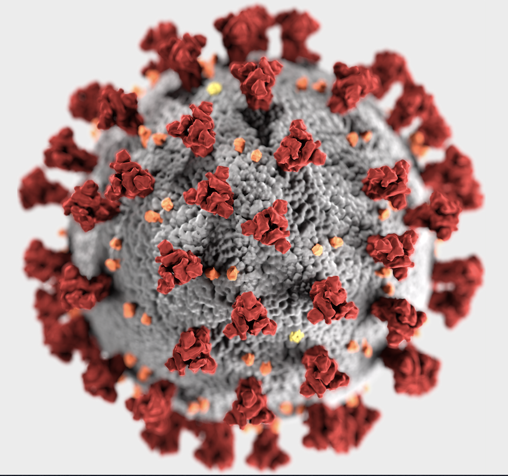

```{r setup, include=FALSE}

knitr::opts_chunk$set(echo = FALSE)

```


## A global pandemic


::: notes

- We've all seen graphs and figures like this in the news over the past weeks, and things can seem very bleak
- We're in the middle of a global pandemic, in which many thousands of people have already died
- Governments across the world are putting in place unprecedented measures to minimise the damage caused by coronavirus
- At the heart of these strategies are mathematical and statistical modelling. In this lecture I'd like to try to explain some of the background and concepts behind this work.

:::


## Talk outline

- What is COVID-19?
- Why is it spreading so fast?
- How do we predict the consequences of the disease and any interventions?
- Models of COVID-19 impacts (Imperial, Oxford)
- How can we tell if our models are likely to be accurate?


::: notes

I'll try to give an accurate overview of the outbreak, but:

- I'm not an epidemiologist or a virologist
- Things are changing rapidly

:::


# What is COVID-19? 


## What is COVID-19?

Defining some terms:

- **COVID-19** is a disease (short for coronavirus disease 2019)
- **SARS-CoV-2** is the virus that causes COVID-19 (short for severe acute respiratory syndrome coronavirus 2)
- **Coronavirus** is a general name for the group of viruses that include SARS-CoV-2.

::: notes

Read more here https://www.who.int/emergencies/diseases/novel-coronavirus-2019/technical-guidance/naming-the-coronavirus-disease-(covid-2019)-and-the-virus-that-causes-it

:::


## SARS-CoV-2 is a virus





::: notes

- A positive-sense single-stranded RNA virus. Positive sense viruses can directly translate viral RNA sequence into viral proteins, so no RNA polymerase needed

- Closest relative is a virus found in bats
- May have passed through an intermediate host (e.g. pangolins) before being transmitted to humans, but not yet clear

Image credit: Alissa Eckert, Dan Higgins, https://commons.wikimedia.org/w/index.php?curid=86444014

:::


## COVID-19 is a disease


::: notes

- Incubation period typically 5-6 days, but may be shorter or longer
- Symptoms include fever, cough and difficulties with breathing
- In many cases symptoms are mild or absent
- But in others can lead to pneumonia, organ failure and death

:::


# Why is COVID-19 spreading so fast?


## Why is COVID-19 spreading so fast?


## Why is COVID-19 spreading so fast?


```{r,fig.width = 5, fig.height = 5, fig.cap="Exponential growth"}
t <- 40
r <- 0.3
x0 <- 10

output <- x0 * (1+r)^c(1:t)

plot(output,type = "l",
     xlab = "Time (days)",
     ylab = "Number of cases")
```


::: notes
- Early stages of pandemic outbreaks fit an exponential growth model
- This means that the amount added at any point in time is proportional to the amount already present
- The rate of exponential growth depends on the starting amount, a growth constant, and time
:::


## Why is COVID-19 spreading so fast?


::: notes

- Why do diseases like covid-19 grow exponentially? Here's a nice illustration in the Washington Post

- Link https://www.washingtonpost.com/graphics/2020/world/corona-simulator/

:::


## Why is COVID-19 spreading so fast?


```{r,fig.width = 10, fig.height = 5, fig.cap = "Exponential growth on linear vs log scales"}

t <- 40
r <- 0.3
x0 <- 10

output <- x0 * (1+r)^c(1:t)

layout(matrix(1:2,1,2))

plot(output,type = "l",
     xlab = "Time (days)",
     ylab = "Number of cases")


plot(output,type = "l",
     xlab = "Time (days)",
     ylab = "Number of cases",log = "y")

```


::: notes

- It's worth pointing out here that if you have truly exponential growth, if you plot it on a log scale you'll get a straight line. This is really useful as we can get an easy estimate of growth rates

:::


## Why is COVID-19 spreading so fast?


::: notes

So if we go back to the FT graph, you'll see that the x axis is visualised on a log2 scale. The lines for the UK, France and Spain are all straight, showing that the number of deaths is growing exponentially. Using the dotted lines we can tell that the number of death in the UK is doubling roughly every two days. The log scales also give us a much easier way of determining if countries are on similar trajectories, especially in the early stages. 

But it's important when you look at any graph that we can tell whether it is on a log scale or not, as the difference is huge.

The author of these graphs has a good explanation of why he uses log scales here: https://twitter.com/jburnmurdoch/status/1237748598051409921

:::


# How do we predict the consequences of the disease? 


## What do we want to predict?


::: notes

- The number of people infected
- The number of people with symptoms
- The number of deaths
- The ability of healthcare systems to cope
- We will focus on infection rates here

:::


## Building a model


::: notes

- This is an SIR model, commonly used in epidemiology
- It is a compartment model, which divides the population up into groups
- Susceptible in blue, infected in green, recovered in red
- It is a mathematical model of population-level processes, based on differential equations
- The thing we want to predict is shapes of these curves, which will depend on a number of things.
- How easily the virus is transmitted
- Rate of contact in a population
- Duration of infection
- The proprtion of susceptible individuals in a population

:::


## Building a model


::: notes

- An increasingly common approach in epidemiology is to use individual based models (sometimes called agent based models)
- Where each individual is simulated in order to predict population-level effects
- Allow us to simulate individual-level processes in a way that cannot easily be captured in compartment models
- But the models will have a lot of assumptions - we'll talk about why this can be a problem later

:::


## Building a model


::: notes

- R0 is the Basic reproduction number
- The average number of people who will catch the disease from a single infected person, in a population where everyone is susceptible
- Encapsulates mode of transmission, contact rates, duration of infection.
- R0 is an average, so summarises a distribution. This distribution is important.
- R0 can change depending on context (e.g. behaviour). This is very important.
- R0 is difficult to estimate, so different researchers can come up with different estimates. This is very very important.
- But this number underpins most preidctions of virus spread

Link to article: https://www.theatlantic.com/science/archive/2020/01/how-fast-and-far-will-new-coronavirus-spread/605632/

:::


## Predicting the impact of interventions


::: notes

- Once we can predict the extent of virus spread, we can then predict what effect an intervention might have
- One key aim is to flatten the curve - this is changing the shape of a histogram
- Flattening the curve reduces the peak number of infections, and psreads the cases out over a longer period of time

Source for graph: https://www.theguardian.com/world/2020/mar/10/covid-19-coronavirus-flattening-the-curve

:::


# Models of COVID-19 impacts


## Models of COVID-19 impacts

- The Imperial College Model
- The Oxford Model


## The Imperial College model


::: notes

Here's the link to the imperial model https://t.co/sRcS7SIdTi?amp=1

:::


## The Imperial College model

An individual-based model, with lots of assumptions:

- Household sizes, school class sizes, workplaces, commuting distances etc. based on census data. Contact rates dependent on these.
- Incubation period of 5.1 days
- $R_0$ = 2.4 (based on data from Wuhan, but looked at 2.0-2.6)
- Symptomatic individuals 50% more infectious than asymptomatic ones
- Short-term immunity to reinfection
- 0.1% (age 0-9) - 30% (age 80+) of cases needing hospitalisation
- 0.002% - 9.3% fatality rate


## The Imperial College model


::: notes

Not much detail about how these interventions were simulated, but the authors say that they use "plausible and largely pessimistic assumptions about the impact of each intervention"

:::


## The Imperial College model


::: notes

- The authors group their interventions into those associated with a "mitigation" strategy. and those associated with a "supression" strategy. 

- The UK government at appeared to thinking about mitigation strategies. 

- But this graph shows they are unlikely to be effective

- The 'do nothing' scenario is predicted to lead to 510,000 deaths, assuming that all patients are treated (so would be larger)

- All mitigation scenarios are likely to be ineffective in that the healthcare system would be overwhelmed many times over, with many thousands of deaths

:::


## The Imperial College model


::: notes

- Interventions based on suppression (social distancing) are much more effective in the short-term, and give us the chance of keeping within the limits of the healthcare system

- But the model suggests that if these measures are relaxed, we could get a bigger peak in the autumn, due to a lack of "herd immunity".

- Clearly, preventing deaths in the short-term is the preferable strategy

:::


## The Imperial College model


::: notes

- Finally, the authors looked at a policy where suppression was used in a dynamic manner, in response to the number of cases rising. 

- The model suggested that this would work in the sense that the healthcare system would be able to cope, but that social distancing would need to be in place for 2/3 of the time, until a vaccine is avilable.

:::


## The Oxford model


::: notes

- We'll take a look at one more model, because it generated some headlines that appeared to completely contradict the Imperial study, and caused some to claim that government interventions were over the top

:::


## The Oxford model


::: notes

Link to the paper here

https://www.medrxiv.org/content/10.1101/2020.03.24.20042291v1

:::


## The Oxford model

- Bayesian SIR model
- Varied two key parameters:
  - $R_0$
  - $\rho$ (proportion of the population at risk of severe disease)
- Three scenarios: 
  1. $R_0$ = 2.25 and $\rho$ = 0.001
  2. $R_0$ = 2.25 and $\rho$ = 0.01
  3. $R_0$ = 2.75 and $\rho$ = 0.01
- Compared number of deaths predicted by model to those observed in UK and Italy


## The Oxford model


::: notes

- The authors found that all three of their scenarios fit their data
- In other words, you could get the patterns we've observed with either lots f infections and low severity, or few infections and high severity
- The model doesn't suggest which of these is the case, and all available evidence suggests that rho is larger than 0.001
- So very unlikely that 50% of the population already infected

:::


# How can we tell if our models are likely to be accurate?


## The problem with models


::: notes

- All of the assumptions that underly R0, and that underly severity of symptoms etc need to data to back them up
- At the moment we don't have very good data so the models have to make a lot of assumptions
- Guardian article here: https://www.theguardian.com/science/2020/mar/25/coronavirus-exposes-the-problems-and-pitfalls-of-modelling

:::


## Testing testing testing


::: notes

Why test?
- Can isolate cases
- Can better quanitfy key parameters of models and refit them
- Can check whether our models are turning out as predicted
- Can implement longer-term, sustainable policies

Link to article https://www.theguardian.com/commentisfree/2020/mar/25/mass-covid-19-testing-is-vital-but-the-data-must-be-localised

:::


## Testing for COVID-19


::: notes
Two main approaches:

- Look for the virus (RT-PCR)
- Look for an immune response to the virus (serological testing)
- RT-PCR approach is well established, whereas serological testing still in development

Link to article https://www.theguardian.com/world/2020/mar/29/the-two-tests-that-will-help-to-predict-spread-of-covid-19
:::


## Going forward

- Open science has never been more important
- Transparency also needed about how complex models are turned into policy
- We need to back up our models with data
- Testing is key

