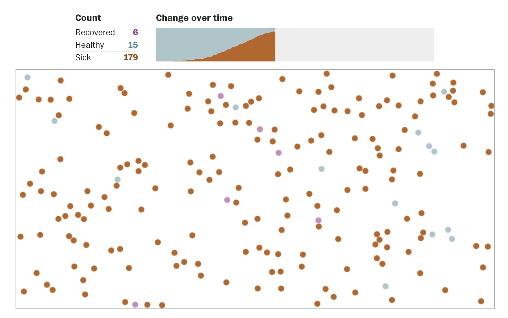

```{r setup, include=FALSE}
library(tidyverse)
knitr::opts_chunk$set(echo = FALSE)

```


## A global pandemic

<div align="center">

</div>


## Talk outline

- What is COVID-19?
- Why is it spreading so fast?
- How do we predict the consequences of the disease? 
- How do we tell if our predictions are likely to be accurate?
- How can we slow and stop the spread of the COVID-19?


# What is COVID-19? 


## What is COVID-19? | Defining some terms

- **COVID-19** is a disease (short for coronavirus disease 2019)
- **SARS-CoV-2** is the virus that causes COVID-19 (short for severe acute respiratory syndrome coronavirus 2)
- **Coronavirus** is a general name for the group of viruses that include SARS-CoV-2.

<br><br><br><br><br><br>

<font size="1">Find out more about the naming of COVID-19 <a href="https://www.who.int/emergencies/diseases/novel-coronavirus-2019/technical-guidance/naming-the-coronavirus-disease-(covid-2019)-and-the-virus-that-causes-it"> here </a> </font>


## SARS-CoV-2 is a virus

<div align="center">

</div>
<br><br>
<font size="1">
Image credit: Alissa Eckert, Dan Higgins, https://commons.wikimedia.org/w/index.php?curid=86444014
</font>


## SARS-CoV-2 is a virus
- A positive-sense single-stranded RNA virus
- Closest relative is a virus found in bats
- May have passed through an intermediate host (e.g. pangolins) before being transmitted to humans, but not yet clear

<div align="center">

</div>
<br><br>
<font size="1">
Image credit: Alissa Eckert, Dan Higgins, https://commons.wikimedia.org/w/index.php?curid=86444014
</font>


<div class="notes">
- Positive sense viruses can directly translate viral RNA sequence into viral proteins, so no RNA polymerase needed

</div>


## COVID-19 is a disease

- Incubation period typically 5-6 days, but may be shorter or longer
- Symptoms include fever, cough and difficulties with breathing
- In many cases symptoms are mild or absent
- But in others can lead to pneumonia, organ failure and death


## Testing for COVID-19

Two main approaches:

- Look for the virus (RT-PCR)
- Look for an immune response to the virus (serological testing)
- RT-PCR approach is well established, whereas serological testing still in development


# Why is COVID-19 spreading so fast?


## Why is COVID-19 spreading so fast?

<div align="center">

</div>


## Why is COVID-19 spreading so fast? | Exponential growth

```{r,fig.width = 5, fig.height = 5, fig.align = "center"}
t <- 40
r <- 0.3
x0 <- 10

output <- x0 * (1+r)^c(1:t)

plot(output,type = "l",
     xlab = "Time (days)",
     ylab = "Number of cases")
```


## Why is COVID-19 spreading so fast? | Exponential growth

- Growth where the amount being added is proportional to the amount already present (e.g. Doubling over time)
- $x_t = x_0(1+r)^t$
- Where *r* is the growth rate and *t* is time


## Why is COVID-19 spreading so fast? | Exponential growth


<div align="center">
<font size="4"> https://www.washingtonpost.com/graphics/2020/world/corona-simulator/ </font>

</div>


# How do we predict the consequences of the disease? 


## How do we predict the consequences of the disease? | What do we want to predict?

- The number of people infected
- The number of people with symptoms
- The number of deaths
- The ability of healthcare systems to cope


## How do we predict the consequences of the disease? | Building a model

- What is the transmission potential of the disease? 
- What proportion of infected people show mild/severe symptoms?
- What is the fatality rate?
- What is the capacity of a given healthcare system?


## How do we predict the consequences of the disease? | Building a model

What is the transmission potential of the disease? 

- How easily the virus is transmitted
- Rate of contact in a population
- Duration of infection
- The proprtion of susceptible individuals in a population


## How do we predict the consequences of the disease? | What is the transmission potential of the disease? 


- $R_0$ is the *Basic reproduction number*
- The average number of people who will catch the disease from a single infected person, in a population where everyone is susceptible
- Encapsulates mode of transmission, contact rates, duration of infection.


## How do we predict the consequences of the disease? | What is the transmission potential of the disease? 

- $R_0$ is an average, so summarises a distribution. This distribution is important.
- $R_0$ can change depending on context (e.g. behaviour). This is very important.
- $R_0$ is difficult to estimate, so different researchers can come up with different estimates. This is very very important.


## How do we predict the consequences of the disease? | What is the transmission potential of the disease? 


<div align="center">

<font size="1"> https://www.theatlantic.com/science/archive/2020/01/how-fast-and-far-will-new-coronavirus-spread/605632/ </font>
</div>


## How do we predict the consequences of the disease? | Building a model


- What proportion of people show symptoms?
- Severe symptoms?
- Fatality rates?


